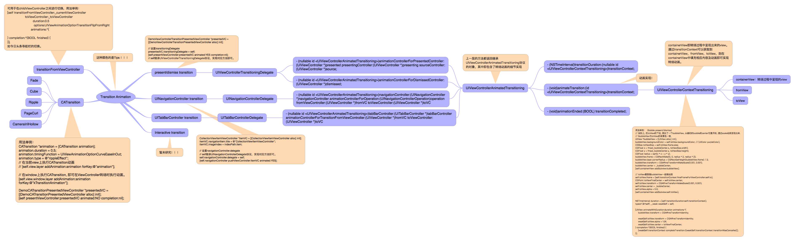

# iOS-TransitionAnimation
Transition animation for iOS.

转场动画在iOS开发中非常常见, 其原理大概如下图:


一切都是从图中的 *** Transition Animation *** 开始.

本文主要基于以上这张图, 讲解了transitionFromViewController, CATransition, TransitionAnimation三种转场实现方式.

## transitionFromViewController
我们可以先看UIViewController自带的方法:
transitionFromViewController:toViewController:duration:options:animations:completion:
参数很多, 不过都非常直观.
通常的使用场景是 在多个Child ViewController之间切换.
```
AViewController *a = self.childViewControllers[0];
BViewController *b = self.childViewControllers[1];
CViewController *c = self.childViewControllers[2];

// Curl 翻页效果
// UIViewAnimationOptionTransitionCurlUp, UIViewAnimationOptionTransitionCurlDown
// Flip 翻转效果
// UIViewAnimationOptionTransitionFlipFromLeft, UIViewAnimationOptionTransitionFlipFromRight
// UIViewAnimationOptionTransitionFlipFromTop, UIViewAnimationOptionTransitionFlipFromDown

[self transitionFromViewController:_currentViewController
                  toViewController:b
                          duration:0.5
                           options:UIViewAnimationOptionTransitionFlipFromRight
                        animations:^{

} completion:^(BOOL finished) {

}];
```
转场的效果可以通过options和animations参数来控制.

### NewsNavigationBar
这个demo是利用transitionFromViewController方法实现的类似网易新闻的导航栏样式.
[DemoNewsNavigationBar](https://github.com/icetime17/iOS-Playground/tree/master/DemoNewsNavigationBar)

## CATransition
CATransition继承自CALayer, 包含了一些场景的动画效果. 如Fade，Cube，Ripple，PageCurl，CameraIrilHollow等.
使用如下:
```
CATransition *animation = [CATransition animation];
animation.duration = 0.5;
animation.timingFunction = UIViewAnimationOptionCurveEaseInOut;
animation.type = kCATransitionFade;

// 在当前view上执行CATransition动画
// [self.view.layer addAnimation:animation forKey:@"animation"];

// 在window上执行CATransition, 即可在ViewController转场时执行动画。
[self.view.window.layer addAnimation:animation forKey:@"kTransitionAnimation"];

DemoCATransitionPresentedViewController *presentedVC = [[DemoCATransitionPresentedViewController alloc] init];
[self presentViewController:presentedVC animated:NO completion:nil];
```
如果仅仅在当前view的layer上添加该动画, 则使用场景不在本文讨论范围之内.
而将该动画添加到window.layer上, 则会在执行present或push操作时, 呈现指定的转场动画效果.
```
[self.navigationController.view.layer addAnimation:animation forKey:@"kTransitionAnimation"];

DemoCATransitionPushedViewController *pushedVC = [[DemoCATransitionPushedViewController alloc] init];
[self.navigationController pushViewController:pushedVC animated:NO];
```

## Transition Animation
iOS中自定义的转场动画, 通常需要两个对象.
### UIViewControllerTransitioningDelegate
继承该协议的对象是transition的代理, 该协议中主要指定了present/dismiss的UIViewControllerAnimatedTransitioning对象.
```
DemoViewControllerTransitionPresentedViewController *presentedVC = [[DemoViewControllerTransitionPresentedViewController alloc] init];
presentedVC.transitionDelegate = self;
[self presentViewController:presentedVC animated:YES completion:nil];
```
该协议包含的方法：
```
//       prenent       
- (id <UIViewControllerAnimatedTransitioning>)animationControllerForPresentedController:(UIViewController *)presented presentingController:(UIViewController *)presenting sourceController:(UIViewController *)source;
//       pop       
- (id <UIViewControllerAnimatedTransitioning>)animationControllerForDismissedController:(UIViewController *)dismissed;
//       prenent       
- (id <UIViewControllerInteractiveTransitioning>)interactionControllerForPresentation:(id <UIViewControllerAnimatedTransitioning>)animator;
//       pop       
- (nullable id <UIViewControllerInteractiveTransitioning>)interactionControllerForDismissal:(id <UIViewControllerAnimatedTransitioning>)animator;
```
前两个方法都返回的是继承UIViewControllerAnimatedTransitioning协议的对象，其中即为转场动画的细节实现。

### UIViewControllerAnimatedTransitioning
实现该协议的对象中即包含了转场动画的细节实现代码, 因此, UIViewControllerTransitioningDelegate对象的作用主要是指定了包含转场动画细节实现的对象.
UIViewControllerAnimatedTransitioning包含的方法主要有：
- 转场动画时间
```
// This is used for percent driven interactive transitions, as well as for container controllers that have companion animations that might need to synchronize with the main animation.
- (NSTimeInterval)transitionDuration:(nullable id <UIViewControllerContextTransitioning>)transitionContext;
```

- 动画结束回调方法
```
@optional

// This is a convenience and if implemented will be invoked by the system when the transition context's completeTransition: method is invoked.
- (void)animationEnded:(BOOL) transitionCompleted;
```

- 转场动画细节实现
该方法中则主要负责转场动画细节的实现.
```
// This method can only  be a nop if the transition is interactive and not a percentDriven interactive transition.
- (void)animateTransition:(id <UIViewControllerContextTransitioning>)transitionContext;
```

- 转场细节中的几个关键变量：
```
_transitionContext = transitionContext;

_containerView = [transitionContext containerView];

_from = [transitionContext viewControllerForKey:UITransitionContextFromViewControllerKey];
_to = [transitionContext viewControllerForKey:UITransitionContextToViewControllerKey];

// iOS8之后才有
if ([transitionContext respondsToSelector:@selector(viewForKey:)]) {
    _fromView = [transitionContext viewForKey:UITransitionContextFromViewKey];
    _toView = [transitionContext viewForKey:UITransitionContextToViewKey];
} else {
    _fromView = _from.view;
    _toView = _to.view;
}
```
containerView即是转场过程中呈现出来的View.
我们能够从transitionContext中获取到fromView和toView, 则用这两个view的内容对containerView进行填充, 即可实现转场细节了.

本文的Demo中实现了几种常见的转场动画, 包括present/dismiss, presentHalf, Bubble, Drawer，push/pop.

### UINavigationControllerDelegate
在UINavigationController的转场中, 要指定UINavigationControllerDelegate对象.
```
self.navigationController.delegate = self;
[self.navigationController pushViewController:itemVC animated:YES];
```

push/pop主要是如下两个方法
```
//              
- (id <UIViewControllerAnimatedTransitioning>)navigationController:(UINavigationController *)navigationController
                                   animationControllerForOperation:(UINavigationControllerOperation)operation
                                                fromViewController:(UIViewController *)fromVC
                                                  toViewController:(UIViewController *)toVC;
//            
- (id <UIViewControllerInteractiveTransitioning>)navigationController:(UINavigationController *)navigationController
animationController;
interactionControllerForAnimationController:(id <UIViewControllerAnimatedTransitioning>)
```

使用如下:
```
#pragma mark - <UINavigationControllerDelegate>

- (nullable id <UIViewControllerAnimatedTransitioning>)navigationController:(UINavigationController *)navigationController
                                            animationControllerForOperation:(UINavigationControllerOperation)operation
                                                         fromViewController:(UIViewController *)fromVC
                                                           toViewController:(UIViewController *)toVC {
    // Push/Pop
    AnimatorPushPopTransition *pushPopTransition = [[AnimatorPushPopTransition alloc] init];

    if (operation == UINavigationControllerOperationPush) {
        pushPopTransition.animatorTransitionType = kAnimatorTransitionTypePush;
    } else {
        pushPopTransition.animatorTransitionType = kAnimatorTransitionTypePop;
    }


    NSArray *indexPaths = [_collectionView indexPathsForSelectedItems];
    if (indexPaths.count == 0) {
        return nil;
    }

    NSIndexPath *selectedIndexPath = indexPaths[0];
    UICollectionViewCell *cell = [_collectionView cellForItemAtIndexPath:selectedIndexPath];

    // 一定要加上convertPoint:toView:操作
    pushPopTransition.itemCenter = [_collectionView convertPoint:cell.center toView:self.view];
    pushPopTransition.itemSize = cell.frame.size;
    pushPopTransition.imageName = [NSString stringWithFormat:@"%ld", (long)selectedIndexPath.item];

    return pushPopTransition;
}
```

### UITabBarController
在UITabBarController的转场中, 同样指定UITabBarControllerDelegate对象即可.
```
//              
- (id <UIViewControllerAnimatedTransitioning>)tabBarController:(UITabBarController *)tabBarController
            animationControllerForTransitionFromViewController:(UIViewController *)fromVC
                                              toViewController:(UIViewController *)toVC;
//            
- (id <UIViewControllerInteractiveTransitioning>)tabBarController:(UITabBarController *)tabBarController
                      interactionControllerForAnimationController:(id <UIViewControllerAnimatedTransitioning>)animationController;
```
使用情况都比较类似, 这里就不多说了.
